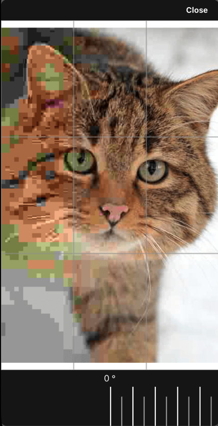
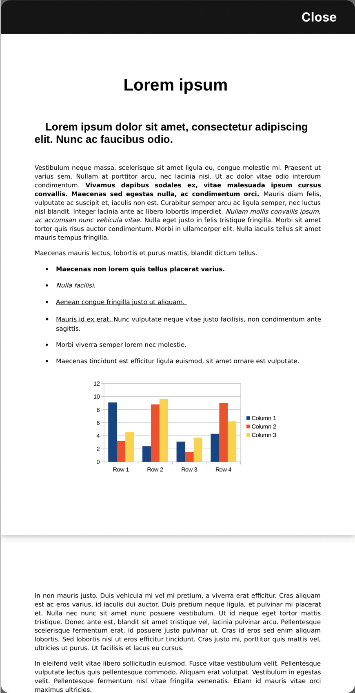

# Welcome to Core File Viewer!

The purpose of this project is to view different type of files, like images or 3d objects.

Currently, the supported file types are: jpeg, jpg, png, webp, pdf and for 3D objects: stl and obj.

In order to display 3D objects, I've used THREE.js an GLView, so you can encounter some problems if you don't have all the packages installed correctly.

Also, for nice animations, I've used Lottie.

# Parameters

## File Sources:

You can use either a web url or if you have aleardy downloaded the file, send the local Uri.

```python
# type 'string'
fileURL - 'web URL for file'

# type 'string'
fileLocalUri - 'local URI for file'
```

You can specify both sources at one, but you will have to tell the viewer which of those will be used sending the next parameter:

```python
# type 'string'
activeSource - 'EXTERNAL_URL' or 'LOCAL_URI'

import { EXTERNAL_URL, LOCAL_URI } from 'rn-core-file-viewer'
```

## File Extension:

Not all sources indicate a file extension, so in order to be sure, the Viewer needs a specific extension.

```python
# type 'string'
fileExtension - all the possible values as described at the begining of docs.

If the extension is not supported, you will see the next error message displayed
'Unknown format'
```

## Controls:

To show the viewer, first set all the needed informations (source, extension, active source - if needed) the change the visibility

```python
# type 'boolean'
isVisible - used to hide or show the viewer

In order to keep the state in sync, a callback will be fiered when the modal is closed from withim the viewer.

onDismissClicked={() => {'...set your state to false'}}
```

## Loading animation:

To make the viewer look nice, I have implemented a waiting background until the file is ready to be displayed, usign Lootie for React Native.

If you don't need it, a default spinner will be used.

To set a nice animation, go to Lootie webpage and search for one

https://lottiefiles.com/featured

One you have found one, download it as JSON and put it in the assets folder, then just link the source to the viewer

```python
# type 'string'
lootieLoadingAnimation - lootie path to file.

Use  ->  require('relative path to file')

lootieLoadingAnimation={require('../assets/lottie/loading-animation')}
```

# Example

```python
  const [activeSource, setActiveSource] = useState('')

  const [fileUrl, setFileUrl] = useState('https://testfile.jpg')
  const [localUri, setLocalUri] = useState('')
  const [fileExt, setFileExt] = useState('jpg')

  const [isVisible, setIsVisible] = useState(false)


  return (
       <CoreFileViewer
          lootieLoadingAnimation={require('../assets/lottie/loading-animation')}
          activeSource={activeSource}
          fileURL={fileUrl}
          fileLocalUri={localUri}
          fileExtension={fileExt}
          isVisible={isVisible}
          onDismissClicked={() => {
            setIsVisible(false)
          }}
        />

       <Button
          title={'Set image'}
          onPress={() => {
            '.. perpare your data for the viewer'
            setActiveSource(EXTERNAL_URL)
            setFileExt('jpg')
            setFileUrl('https://external-preview.image.jpg')
          }}
        />;

       <Button
          title={'Open viewer'}
          onPress={() => {
            setIsVisible(!isVisible)
          }}
        />);

```




## Caching mechanism

The file explorer supports file caching for faster loads and less network consumption. Just set **cachingActive** to true. Default if false.

## Features

Images have implemented pinch zoom and rotation.

3D objects also have spatial rotation on all axis plus pinch zoom.

Pdfs have pich zoom and touch control implemented.
